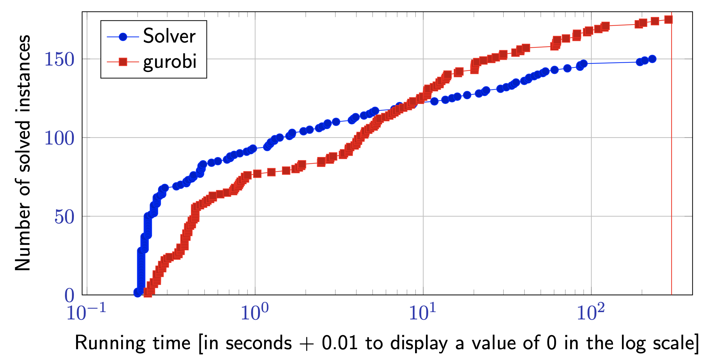

# Weighted Cluster Editing

This package provides an exact solver for the Weighted Cluster Editing Problem.
It implements the branch-and-bound algorithm by [Böcker et al.](https://www.sciencedirect.com/science/article/pii/S0304397509003521) and features:
## Heuristics
- Greedy-Algorithm by [Rahmann et al.](https://pub.uni-bielefeld.de/record/2499481)
- Randomized Approximation
- Local Search

todo: plots with solution quality and running times

## Data Reduction Rules
- "Heavy Edge": Merge too expensive edges' vertices
- "Heavy Non Edge" 
- "Heavy Edge Sinlge End" 
- "Heavy Edge Both Ends"
- "Large Neighborhood"

todo: plots with impact of reduction rules on instance size and respective running times

## Lower Bounds
- LP-Relaxation solved by Gurobi

todo: plot lb/optimum

## Benchmarks
Datasets: random, real-world [cite]

Performance Comparison with Gurobi



## Getting started
1. Install Docker
2. Clone repo and cd into it
```bash
git clone https://github.com/jonasschultemattler/wce
cd wce
```
3. Build the Docker image:
```bash
docker build -f docker/Dockerfile -t wce .
```
4. Download datasets
```bash
wget https://fpt.akt.tu-berlin.de/pace2021/exact.tar.gz && tar -xf exact.tar.gz
```
5. Setup gurobi
6. Run solver

